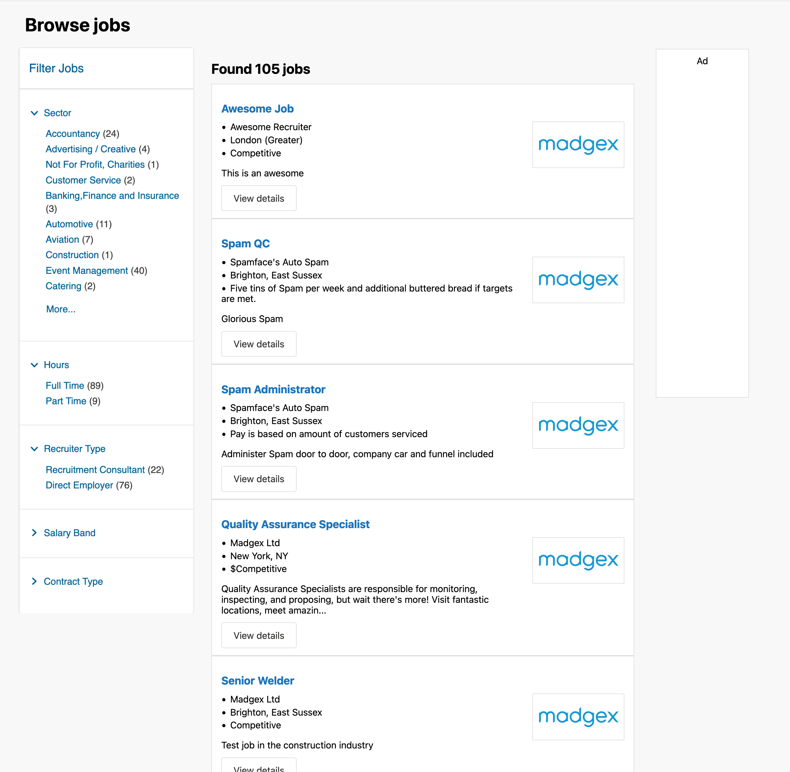

# Frontend practical exercise

We have a page that is currently being developed for the job board project. It needs a `Filter Jobs` sidebar added, based on existing taxonomy data.

We’d like you to take up the reins and progress the project as much as you feel is enough to demonstrate your abilities. As a guide we’d allow 2-3 hours for this exercise, we’re not so much concerned with a ‘finished’ project, more a strong indication as to how you’ve tackled what you aimed to achieve.

## What we're looking for

- Implement the `Filter Jobs` sidebar, see the visual mock up (`visual-mock-up.png` image in the root of this project)



- A faithful representation of the sidebar design using HTML, CSS, potentially some client-side JS if you feel the design/UX would benefit. How much of the design you decide to interpret is up to you.
- On the Node.js backend there's a static model available, `taxonomy`, in the route for this page.

A guide on what we might ask after:

- That you understood the project setup & were able to run with it.
- Websites should be responsive. The static mockup doesn’t cover that, did you get creative?
- Adoption/usage of the Nunjucks templating language https://mozilla.github.io/nunjucks/templating.html
- Your mark-up.
- Any comments on the accessibility of the document.
- Does the design work for you? If not, what constructive feedback would you give?
- Do you foresee any cross-browser issues with your build?
- Did you see anything else that could be improved?

**Note**: This is an exercise only and not a reflection of how we work at Madgex.

## Prerequisites

You'll need to have [Node v18+](https://nodejs.org/download) installed.

## Installing the server dependencies

Install the required modules to run your local [Hapi.js](https://hapijs.com/) server.

In the root of the project run

```
npm install
```

## Developing / Running the server

In the root of the project run

```
npm run dev
```

This will start the [Hapi](https://hapijs.com/) server, and start a development Vite server which serves/builds the CSS and JS.

By default the Hapi server will be running http://localhost:3000 , start here to view the page.

The Vite development entry URL ( http://localhost:8887/src/index.js ) is already added to the page, so CSS/JS etc will display on the page at http://localhost:3000 .

## Assets

### CSS / JS

The source code for the CSS/JS is found in`./apps/assets`, this is where the Vite app is found.

### Other/Images

There is a static assets folder `./lib/public` you can place static assets in that do not need to be built such as images, which will be available on the route `/assets/{file*}`.

### Template files

The [Nunjucks](https://mozilla.github.io/nunjucks/templating.html) template files are found in `./lib/templates`

## This stack won't show my strengths

If you think your abilities are best shown with an alternative setup, you're welcome to refactor to your hearts content.

### Running in Production Mode (optional)

Although you do not need to worry about production mode and just concentrate on development, you can build and run in production mode (this is completely optional):

- `npm run build` This will build the Vite assets into `./lib/public/client`
- `npm run start` This will run the Hapi server only in production mode, the build client assets will be in the `<head>` of the page instead of the Vite dev server.
